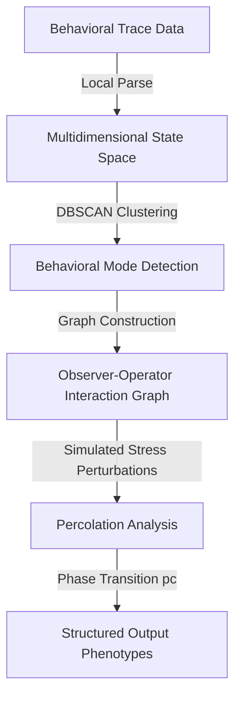

# Executive Function OS (EFOS) — BMS 4.0 Percolation Engine

> **Privacy-preserving digital phenotyping infrastructure for computational psychiatry and life-sciences research.**

EFOS is an open-source, client-side framework that converts naturalistic behavioral trace data into quantitative structural phenotypes of executive function. All computation runs locally in the user's browser sandbox – no raw interaction data ever leaves the user's device. 

*EFOS is a research tool, not a clinical diagnostic.*

---

## 🔗 Project Resources
* **Live Demo & Simulation:** [https://demo.executivefunctionos.com/](https://demo.executivefunctionos.com/)
* **Repository Audits:** Code and validation tests are open-source.
* **Academic Contact:** [annika@executivefunctionos.com](mailto:annika@executivefunctionos.com)

---

## 🧠 How It Works

EFOS models the dynamics of executive function using network science and percolation theory. It translates passive digital traces (e.g., Google Workspace activity metadata) into structured network typologies:



1. **Local Data Ingestion:** Users authorize read-only OAuth access to document metadata logs. The parser extracts timestamped action/view transitions without reading file contents or body text.
2. **Temporal DBSCAN Clustering:** The engine projects interaction patterns into a temporal state space. DBSCAN identifies dense clusters representing sustained cognitive tasks, separating them from isolated, low-density transitions (noise).
3. **Graph Construction:** An interaction graph $G=(V,E)$ is constructed. Vertices ($V$) represent cognitive states categorized into "Observer" nodes (sensory/information intake) and "Operator" nodes (execution/output), bridged by executive-function nodes. Edges ($E$) represent transition probabilities.
4. **Percolation Analysis:** The model simulates cognitive stress by sequentially deleting edges. It calculates the percolation threshold $p_c$ at which the largest connected component (the giant component) spanning the Observer-Operator layers fragments, signifying task paralysis.

---

## ⚡ Quickstart

### Prerequisites
* [Fast Node Manager (fnm)](https://github.com/Schniz/fnm) or [Node.js](https://nodejs.org/) (v20.x recommended)
* npm (v10.x or higher)

### Setup & Run
1. Clone the repository:
   ```bash
   git clone https://github.com/Executive-Function-OS/percolation-import.git
   cd percolation-import
   ```
2. Initialize Node v20 via `fnm` (if using fnm):
   ```bash
   fnm use
   ```
3. Install dependencies:
   ```bash
   npm install
   ```
4. Copy the environment configuration and set your local OAuth Client ID:
   ```bash
   cp .env.example .env.local
   # Edit .env.local and configure NEXT_PUBLIC_GOOGLE_CLIENT_ID
   ```
5. Spin up the local development server:
   ```bash
   npm run dev
   ```
6. Open [http://localhost:3000](http://localhost:3000) in your browser. Navigating to `/engine` accesses the local Analysis Engine.

### Testing
We enforce strict test coverage for all core classifiers. Run the Vitest unit tests:
```bash
npm run test
```

---

## 📊 Structured Example Outputs

EFOS generates anonymized structural output packages directly on-device. The data packages contain no personally identifiable information (PII) or raw filenames:
* **GraphML (`.graphml`):** The topology of the Observer-Operator interaction network, including node types (Observer, Operator, Bridge) and edge weights (transition frequencies).
* **Metrics Package (`.json`/`.csv`):** Quantitative metrics including computed coupling strength ($\kappa$), estimated percolation threshold ($p_c$), cluster counts, and temporal density values.
* **PDF Report (`.pdf`):** A research-grade summary of the phase transition curves and system typology classification.

---

## 🗺️ 2-Year Project Roadmap

Our development and validation roadmaps are aligned with the Renaissance Philanthropy OS4LS Track 1 goals:

### Year 1: Convergent Validation & API Hardening
* **Q1:** Protocol pre-registration on the Open Science Framework (OSF); anchor academic lab partnerships for IRB sponsorship.
* **Q2:** Recruit the external pilot cohort ($N=30\text{–}50$) via the Participate portal to correlate Fragmentation Scores with BRIEF-A/BDEFS profiles.
* **Q3:** Publish open API specifications for custom interaction data adapters.
* **Q4:** Conduct an independent security audit of the browser-based zero-knowledge engine.

### Year 2: Multi-Site Ingestors & Pipeline Integrations
* **Q5:** Add data adapters for local filesystems and window tracking services (e.g., RescueTime logs).
* **Q6:** Launch multi-site clinical validation trials with partner psychiatric clinics.
* **Q7:** Integrate structured EFOS GraphML exports with Python (`networkx`) and R (`igraph`) pipelines.
* **Q8:** Publish peer-reviewed methodology and validation results in computational psychiatry journals.

---

## 🤝 Contributing & Data Sharing
We welcome contributions from researchers and software engineers.
* See [CONTRIBUTING.md](CONTRIBUTING.md) for pull request guidelines, test requirements, and methods note formatting.
* See [DATA_SHARING.md](DATA_SHARING.md) to review our zero-knowledge compliance architecture and data handling ethics protocols.

---

## ⚖️ License
This project is licensed under the MIT License - see the [LICENSE](LICENSE) file for details.
