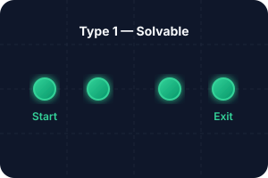
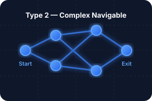
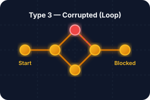
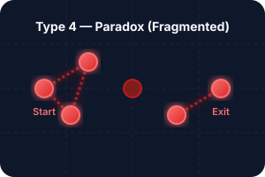

# Demo: Executive Function OS

*Cognitive Flight Recorder / Translation Manual*

---

## Observer Layer: Raw Trace

The raw, unfiltered digital footprint of activity before interpretation.

-   **Density:** `Variable`
-   **Status:** `Monitoring`
-   **Timestamp:** `23:04:04 GMT`

---

## System Typologies

### Type 1 — Solvable

A healthy system with clear goals.

- **Observer:** Predictable outcome loops
- **Operator:** Belief aligns with reality

### Type 2 — Complex Navigable

Intricate system requiring navigation.

- **Observer:** Branching clusters
- **Operator:** Probabilistic heuristics

### Type 3 — Corrupted

Repetitive, unproductive cycling.

- **Observer:** Inverse outcomes
- **Operator:** Dominated by corrupted installations

### Type 4 — Paradox System

Extreme fragmentation or lock-in — both pathological extremes in this model.

---

## Intervention Threshold

!!! warning "Alert"
    **Critical point prior to collapse. Trigger BMS 4.0 Protocols**

---

## Operator Output Layer

**Resolved** — Post-intervention state. The clean, optimized action layer.

- **Fragmentation:** `0.42% (Stabilized)`
- **Operator Inference:** `Successfully Exited`

---

## Methods & Assumptions

This platform uses a percolation-theoretic framing to model cognitive network fragmentation.

- **Data flow:** Behavioral digital trace data are projected into a multidimensional state space.
- **Transformations:** DBSCAN identifies irregular behavioral clusters. Network edges are then constructed from temporal adjacency, cluster similarity, and file co-occurrence.
- **Assumptions:** The model treats "Observer" and "Operator" states as networked processes bridged by executive-function nodes. Stress preferentially degrades those bridges.

---

## Planned HybridRAG Expansion

| Output | Data Source | Purpose |
|--------|-------------|---------|
| **Conversation State** | Knowledge Graph + Timeline | Near real-time after initial indexing; dynamic filters query cached graph. |
| **Executive Function Gaps** | LLM Pattern Detection | Identify decision friction, deferral patterns |
| **Procedural Bottlenecks** | Graph Analysis | Circular dependencies, unresolved paths |
| **Observer vs Operator** | Text Classification | Ground truth vs belief divergence (e.g., inferred vs recorded paths) |

---

## Interpretation & Limitations

The percolation simulation shows how network connectivity changes under stress. A connected state indicates pathways for execution. A broken state indicates reduced coordination, localized fixation, or task paralysis.

> **Limitations:** This is a theoretical model. It does not represent a clinical diagnosis or a direct map of neural pathways. It should not be used to infer treatment efficacy or broad cognitive capacity.

---

## Validation & Next Steps

Current checks are internal: face validity, logical consistency, and verification under assumed parameters. External validation against N=1 or larger cohort data is ongoing. The goal is a transparent, reproducible tool for computational psychiatry.

[Learn about the Planned Case-File Pipeline :material-arrow-right:](https://github.com/erikssonaicloud-gif/percolation-import)

---

## Interactive Simulator

<iframe src="/simulator" style="width: 100%; height: 800px; border: 1px solid var(--md-code-bg-color); border-radius: 0.5rem; background: transparent; margin-top: 1rem;"></iframe>

