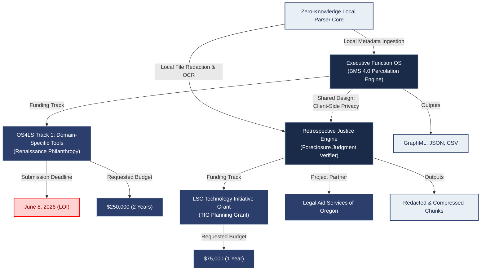
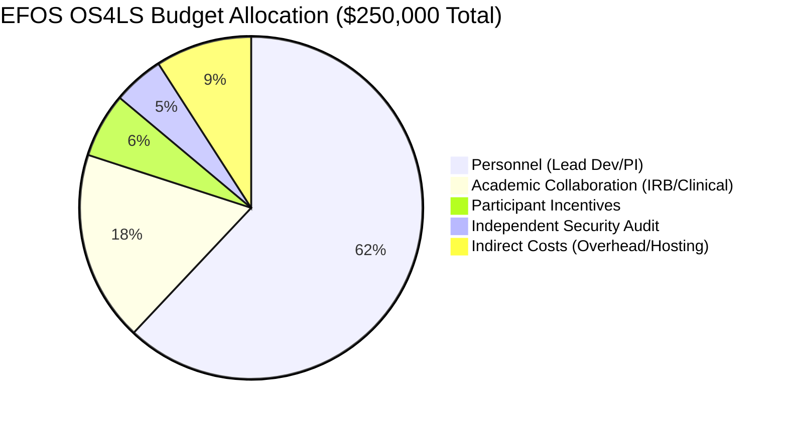

# Grants, Schema & Roadmap

This page outlines the funding tracks, organizational schema, and timelines mapping the **Executive Function OS (EFOS)** and the **Retrospective Justice Engine (RJE)**. Both projects share a core philosophical commitment: **100% client-side, zero-knowledge local computation** to ensure absolute data privacy and security.

> [!WARNING]
> **CRITICAL DEADLINE REMINDER**
> The Letter of Intent (LOI) submission deadline for the **Open Source for the Life Sciences (OS4LS) Grant** is **June 8, 2026** (in less than 48 hours). 

---

## I. Structural Schema & Relational Architecture

The diagram below illustrates how both endeavors are connected at the systemic and code level. While they serve different domains (cognitive phenotyping vs. legal defense), they branch from the same parent design—local, zero-knowledge parsing and optimization pipelines:

---

## II. Comparative Funding Tracks

| Track / Metric | OS4LS Track 1 (Renaissance Philanthropy) | LSC TIG Planning Grant (LASO Partner) |
| :--- | :--- | :--- |
| **Project Name** | **Executive Function OS (EFOS)** | **Retrospective Justice Engine (RJE)** |
| **Focus** | Computational Psychiatry & Digital Phenotyping | Foreclosure Defect Auditing & Pleading Assembly |
| **Funder** | Open Source for Science Fund | Legal Services Corporation (LSC) |
| **Requested Funding**| $250,000 (Direct: $227,273 / Indirect: $22,727) | $75,000 (Planning + One-County Pilot) |
| **Project Term** | 2 Years (Sept 1, 2026 – Aug 31, 2028) | 12 Months (Planning phase) |
| **Current Deadline** | **June 8, 2026 (LOI Submission)** | Planning & Draft Filing Phase (June 2026) |
| **Core Deliverable** | Open-source client-side percolation analysis tool | Modular, automated verifier & PDF packager |

---

## III. Detailed Roadmaps & Milestones

=== "🧠 EFOS (OS4LS Grant Timeline)"

    ### Year 1: Convergent Validation & Pipeline Hardening
    *   **Milestone 1 (Months 1–3):** Clinical and academic protocol pre-registration on the Open Science Framework (OSF). Establish partnership with an academic lab to act as the IRB sponsor.
    *   **Milestone 2 (Months 4–6):** Complete recruitment for the external pilot cohort (Target: $N=30\text{–}50$) to evaluate the correlation between client-side computed Fragmentation Scores and baseline BRIEF-A/BDEFS profiles.
    *   **Milestone 3 (Months 7–9):** Hardening of the client-side Google Workspace OAuth ingestion parser and publication of an open API specification for custom data adapter integration.
    *   **Milestone 4 (Months 10–12):** Independent security and cryptography audit of the client-side database model to ensure complete zero-knowledge integrity.

    ### Year 2: Multi-Site Ingestors & Pipeline Integrations
    *   **Milestone 5 (Months 13–15):** Development of local data adapters for additional passive interaction sources (e.g., RescueTime window activity logs, local filesystem watchdogs).
    *   **Milestone 6 (Months 16–18):** Launch of a multi-site clinical validation study in collaboration with a partner psychiatric research center.
    *   **Milestone 7 (Months 19–21):** Integration of structured EFOS outputs (GraphML/JSON) into common downstream scientific analysis environments (e.g., python `networkx`, R `igraph`) and downstream AI pipelines.
    *   **Milestone 8 (Months 22–24):** Publication of validation study results in peer-reviewed journals (e.g., *Computational Psychiatry* or *Nature Mental Health*) and release of EFOS v1.0.0.

=== "⚖️ RJE (LSC TIG Grant Timeline)"

    ### Phase 1: Planning & Tool Integration (Months 1–4)
    *   **Milestone 1:** Finalize joint planning board with LASO; establish requirements for Clackamas County e-filing pipeline.
    *   **Milestone 2:** Implement local caching mechanism (`.pipeline_cache.json`) to allow incremental, low-bandwidth citation audits during field testing.
    *   **Milestone 3:** Standardize redaction mappings registry for parallel citations to prevent false negatives on dotless citations.

    ### Phase 2: One-County Pilot & Validation (Months 5–8)
    *   **Milestone 4:** Run the verifier pipeline against historical Clackamas County foreclosure cases to validate the detection rate of standing and service defects.
    *   **Milestone 5:** Compile consolidated and watermarked exhibit packages (automatically compressed to remain under the court's 25 MB limit) for pilot cases.
    *   **Milestone 6:** Finalize a secure, local-only interface for legal aid attorneys to run redaction and assembly tasks locally on their workstations.

    ### Phase 3: Scaling & Tool Dissemination (Months 9–12)
    *   **Milestone 7:** Containerize the verifier pipeline scripts (Cloud Run ready) with required system dependencies (libreoffice, tesseract-ocr, ghostscript).
    *   **Milestone 8:** Draft a final evaluation report detailing the number of void judgments identified and remedied; package the CLI tool for statewide legal aid deployment.

---

## IV. Budget Allocations (EFOS OS4LS Track)

*   **Personnel (Lead Dev/PI):** $155,000 (Algorithm optimization, client-side engineering, study management)
*   **Academic Collaboration:** $45,000 (Co-investigator clinical support, IRB sponsorship costs)
*   **Independent Security Audit:** $12,000 (Zero-knowledge architecture and local data security review)
*   **Participant Incentives:** $15,273 (Compensation for longitudinal cohorts, EMA surveys & data donation)
*   **Indirect Costs (10%):** $22,727 (Institutional overhead, hosting, open-access publication fees)
