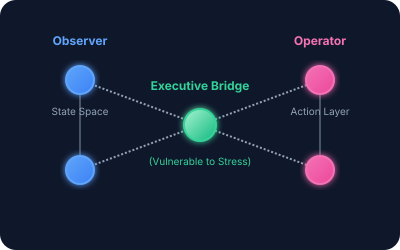

# Methodology

## Core Framework: Observer–Operator Dynamics

The model treats "Observer" and "Operator" states as networked processes bridged by executive-function nodes. The Observer corresponds to raw cognitive awareness and sensory input, while the Operator represents actionable output and behavior. Stress preferentially degrades these bridges, leading to fragmentation.

---

## DBSCAN + Percolation Pipeline

1. **Data projection:** Behavioral digital trace data are projected into a multidimensional state space.
2. **Cluster detection:** DBSCAN identifies irregular behavioral clusters.
3. **Network construction:** Edges are constructed from:
   - Temporal adjacency
   - Cluster similarity
   - File co-occurrence
4. **Percolation analysis:** The network undergoes simulated stress, and the fragmentation threshold \(p_c\) is estimated.

---

## Percolation Mathematics

Let \(G = (V, E)\) be the cognitive interaction graph, where:
- \(V\) = set of cognitive states (Observer clusters + Operator clusters + Executive nodes)
- \(E\) = weighted edges representing transition probabilities and co-occurrence strengths.

Under stress, each edge is removed with probability \(f(s)\), where \(s\) is the stress level. The network remains functional as long as a giant connected component exists between Observer and Operator layers.

The percolation threshold \(p_c\) satisfies:

\[
\mathbb{P}[\text{spanning cluster exists}] =
\begin{cases}
0 & \text{if } p < p_c \\
1 & \text{if } p > p_c
\end{cases}
\]

The **Fragmentation Score** \(F(p)\) is defined as:

\[
F(p) = 1 - \frac{\text{size of largest connected component}}{|V|}
\]

When \(F(p) > 0.5\), the system is considered fragmented — Operator outputs no longer reliably follow Observer inputs.

---

## HybridRAG Expansion

A three-stage pipeline for processing large case-file corpora:

### 01 PDF Processing
Extract structured text using unstructured (standard PDFs) or Tesseract OCR (scanned documents). Chunk and clean for LLM ingestion.

### 02 Knowledge Graph Construction
LLM extracts entities (actors, obligations, deadlines) and relationships (dependencies, contradictions). Store in Neo4j as nodes and edges for relational reasoning.

### 03 HybridRAG Retrieval
Combine vector embeddings (Qdrant/FAISS) for semantic search with graph queries for structural analysis.

### Core Visualizations

| Visualization | Data Source | Purpose |
|---------------|-------------|---------|
| **Conversation State** | Knowledge Graph + Timeline | Near real-time after initial indexing |
| **Executive Function Gaps** | LLM Pattern Detection | Identify decision friction, deferral patterns |
| **Procedural Bottlenecks** | Graph Analysis | Circular dependencies, unresolved paths |
| **Observer vs Operator** | Text Classification | Ground truth vs belief divergence |

---

## Validation Framework

- **Internal consistency:** Face validity, logical consistency under assumed parameters.
- **External validation:** Ongoing against N=1 and larger cohort data.
- **Known limitations:** Not a clinical diagnosis; does not map directly to neural pathways.
